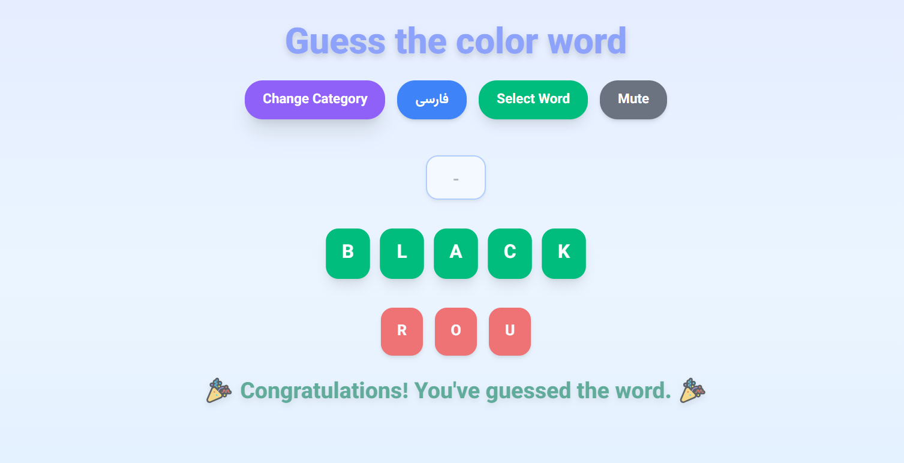

# 🍀 Guess The Name Game

An interactive word-guessing game built with React and styled using Tailwind CSS.  
Players try to guess letters of a word based on selected categories, with real-time feedback and subtle animations.

---

## 🔍 Preview




---

## 🚀 Features

- Select a word category (English or Persian)  
- Guess letters with instant feedback  
- Correct letters turn green, wrong letters appear in red  
- Win/Loss messages with animations  
- Background music with mute/unmute option  
- Win and loss sound effects  
- Responsive and visually appealing UI with Tailwind CSS  
- Subtle animations for correct and wrong letters
  
---

## 🧠 Technologies Used

- React (Functional Components & Hooks)  
- Tailwind CSS  
- JavaScript (ES6+)  
- UUID for unique letter IDs  

---

## 🧩 How It Works

1. Choose a category to select words from.  
2. Click **Select Word** to start the game.  
3. Input letters to guess the word:  
   - Correct letters reveal in the word area  
   - Wrong letters appear in a separate section  
4. The game ends when all letters are guessed (win) or wrong guesses exceed the word length (loss).  
5. Background music and sound effects play accordingly.  

---

## ⚙️ Installation & Usage

### Clone the Repository
```bash
git clone https://github.com/Yasin-Rahimi/GuessTheNameGame.git
cd GuessTheNameGame
